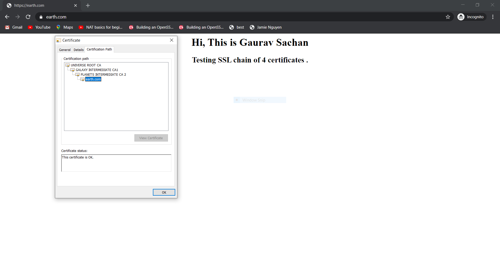

# opensslproject

## Description

#### SSL chain creation and installation // Becoming a Root CA
	
In this project I have created a SSL chain of 4 certificates ( 1 Root CA , 2 Intermediate CA's and 1 server certificate )  

>### Tools Used: openssl , git , visual studio code

#### Final Output

## Folder and Files structure followed

>* ### Root CA Folder
>	* Certificate Folder
>		* root_CA certificate
>	* Private Key Folder
>		* root_CA private key
>	* root_CA configuration file.cnf
>* ### Intermediate CA 1 Folder 
>	* Certificate Folder
>		* intermediate_CA1 certificate
>	* Private Key Folder
>		* intermediate_CA1 private key
>	* CSR  Folder
>		* intermediate_CA1 CSR certificate
>	* intermediate_CA1 configuration file.cnf  
>* ### Intermediate CA 2 Folder 
>	* Certificate Folder
>		* intermediate_CA2 certificate
>	* Private Key Folder
>		* intermediate_CA2 private key
>	* CSR  Folder
>		* intermediate_CA2 CSR certificate
>	* intermediate_CA2 configuration file.cnf 
>* ### Server Certificate Folder 
>	* Server Certificate
>	* Server Private Key 
>	* Server CSR Certificate  
  

# Installation and configuration guide

Will publish later
 ...

 **Source referred :**  [https://jamielinux.com/docs/openssl-certificate-authority/]
